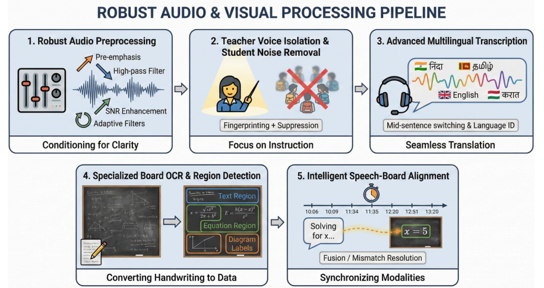
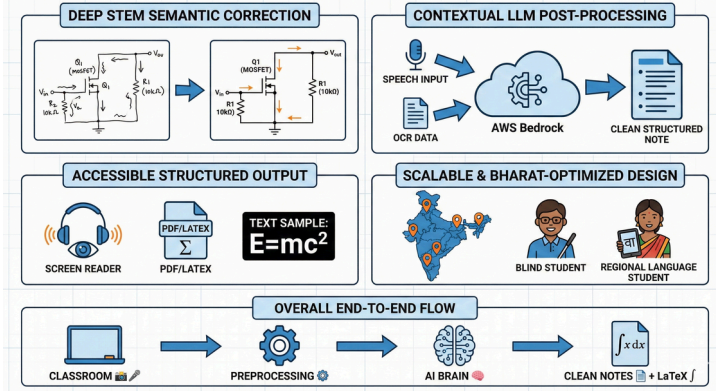

<h1 align="center">AksharVaani — अक्षरवाणी</h1>

<p align="center">
  <strong>End-to-End Multimodal AI System for Accessible STEM Education</strong>
</p>

<p align="center">
  <em>From a chaotic Indian classroom → to structured, accessible STEM knowledge<br/>for blind, deaf, and regional-language students — in real time.</em>
</p>

<p align="center">
  <a href="#-architecture"></a>
  <a href="#-quick-start"></a>
  <a href="LICENSE"></a>
  <a href="#-key-technologies"></a>
</p>

<p align="center">
  <a href="#-the-problem">Problem</a> •
  <a href="#-architecture">Architecture</a> •
  <a href="#-yolo-intelligent-routing">YOLO Routing</a> •
  <a href="#-braille-output--hardware">Braille</a> •
  <a href="#-quick-start">Quick Start</a> •
  <a href="#-roadmap">Roadmap</a>
</p>

---

## 🎯 The Problem

> **In India, over 200,000 visually impaired students** across 386+ special schools are systematically excluded from STEM education.

A professor writes `∫ x² dx = x³/3 + C` on the board while saying *"so we integrate x-squared"* — but:

- A **blind student** can't see the equation.
- A **hearing-impaired student** can't hear the explanation.
- A **regional-language student** doesn't understand the English terminology.
- A student with **dyslexia** can't parse the messy handwriting.

Existing tools solve only **one piece** of this puzzle. Google STT gives you speech. MathPix gives you equations. Neither fuses them together, corrects for noise, or outputs in an accessible format.

**78% of visually impaired students drop STEM after Grade 7.** Not because they can't think — but because they can't access what's being taught.

### AksharVaani fixes this.

We built a **complete end-to-end system** that captures everything happening in a live classroom — the professor's voice, the board content, the hand-drawn diagrams — and converts it all into **clean, structured, accessible knowledge** delivered via Braille, TTS, screen readers, and LaTeX.

---

## 💡 What AksharVaani Does

```
  🎙️ Professor speaks              📷 Board is photographed
        │                                    │
        ▼                                    ▼
  ┌──────────────┐               ┌───────────────────┐
  │ Audio Pipeline│               │ YOLO Object Router │
  │ Denoise → STT │               │ Detect + Classify  │
  └──────┬───────┘               └────┬────┬────┬────┘
         │                            │    │    │
         │                    ┌───────┘    │    └────────┐
         │                    ▼            ▼             ▼
         │              ┌─────────┐ ┌───────────┐ ┌──────────┐
         │              │Text/Eqn │ │  Graphs   │ │ Diagrams │
         │              │PaddleOCR│ │CNN Curves │ │ Gemma 4  │
         │              └────┬────┘ └─────┬─────┘ └────┬─────┘
         │                   │            │            │
         ▼                   ▼            ▼            ▼
  ┌─────────────────────────────────────────────────────────┐
  │         🧠 Multimodal Alignment Engine (LLM)            │
  │     OCR ↔ STT Cross-Validation · SymPy Validation       │
  │     Groq/Gemini Post-Processing · Confidence Routing     │
  └────────────────────────┬────────────────────────────────┘
                           │
           ┌───────────────┼───────────────┐
           ▼               ▼               ▼
     ┌──────────┐   ┌──────────┐   ┌──────────────┐
     │  Screen  │   │  LaTeX   │   │  ⠃⠗⠁⠊⠇⠇⠑    │
     │  Reader  │   │   PDF    │   │  Braille HW  │
     └──────────┘   └──────────┘   └──────────────┘
```

| Input | Processing | Output |
|-------|-----------|--------|
| Noisy classroom audio (Hindi + English) | Speaker isolation → Whisper → LLM cleanup | Clean professor-only transcript |
| Handwritten equations on board | YOLO detection → PaddleOCR → SymPy validation | Structured LaTeX equations |
| Hand-drawn graphs & curves | YOLO detection → CNN stroke analysis → curve fitting | Mathematical function descriptions |
| Circuit diagrams & figures | YOLO detection → Gemma 4 VLM → semantic reasoning | Textual diagram descriptions |
| All modalities combined | Hybrid alignment engine | Accessible Braille / TTS / PDF |

---

## 🏗️ Architecture

### Stage 1 — Robust Audio & Visual Processing Pipeline

<p align="center">
  
</p>

The system captures two simultaneous input streams from the classroom:

**Audio Path (Left → Right, Top Row):**
1. **Robust Audio Preprocessing** — Pre-emphasis filtering, high-pass filter, SNR enhancement, and adaptive noise gates designed for Indian classroom acoustics (fan hum, student chatter, echo).
2. **Teacher Voice Isolation** — ECAPA-TDNN speaker fingerprinting isolates the professor's voice and suppresses student noise — not just diarisation, but active suppression.
3. **Advanced Multilingual Transcription** — Faster-Whisper handles Hindi-English code-switching with mid-sentence language switching and automatic language ID.

**Vision Path (Bottom Row):**
4. **Specialized Board OCR & Region Detection** — YOLO-based object detection classifies every region on the board into **Text**, **Equation**, **Graph**, or **Diagram**, then routes each to its specialized processor.
5. **Intelligent Speech-Board Alignment** — The OCR output and STT transcript are temporally aligned and cross-validated. If the professor says *"v equals u plus at"* while writing `v = u + at`, the system uses both signals to produce a high-confidence result.

### Stage 2 — Deep Processing & Accessible Output

<p align="center">
  
</p>

6. **Deep STEM Semantic Correction** — Circuit diagrams pass through our Gemma 4 VLM layer for component-level identification. Graphs pass through CNN stroke analysis. Equations get SymPy validation.
7. **Contextual LLM Post-Processing** — Groq (Llama 3.3 70B) and Gemini act as constrained formatters — not oracles. They clean OCR noise using speech context, with temperature=0.1 to prevent hallucination.
8. **Accessible Structured Output** — Final output is delivered in multiple formats: screen reader text, PDF/LaTeX with proper math notation, and **physical Braille via our custom hardware interface**.

---

## 🎯 YOLO Intelligent Routing

> **This is the brain of the vision pipeline.** Instead of throwing the entire board image at a single OCR engine, we first detect *what* is on the board, then route each component to its specialized processor.

We are training a custom **YOLOv8 object detection model** on a **real-world Indian classroom dataset** that we collected and annotated ourselves. The model classifies board regions into:

| Detected Region | Routed To | Processing |
|----------------|-----------|-----------|
| 📝 **Text / Equations** | PaddleOCR + SymPy | Pattern-matched OCR → symbolic validation → LaTeX |
| 📈 **Graphs / Curves** | CNN Curve Extractor | Stroke analysis → curve fitting → function extraction |
| 🔌 **Diagrams / Circuits** | Gemma 4 VLM | Vision-language reasoning → component identification → textual description |

### CNN Curve Extractor (Currently Functional)

Our custom CNN model performs **stroke analysis on real-world classroom board images** to extract mathematical curves and graphs. Currently operational via Jupyter notebooks, it:

- Detects plotted curves from noisy, hand-drawn classroom graphs
- Extracts coordinate points and fits mathematical functions
- Converts visual graphs into machine-readable mathematical descriptions

This model is being **fine-tuned with real labelled classroom images** to improve accuracy on diverse handwriting styles, chalk-on-blackboard contrast, and varying board conditions.

### Gemma 4 VLM for Diagrams

For complex visual content that OCR can't handle — circuit diagrams, state machines, flowcharts, molecular structures — we route through **Google's Gemma 4 Vision-Language Model**. This gives us deep semantic understanding of visual content, not just pixel-level detection.

---

## ♿ Braille Output & Hardware

> **AksharVaani doesn't stop at software.** We are building the full accessibility loop — from classroom capture to a student's fingertips.

### Virtual Braille Interface (Built ✅)

We have developed a **Virtual Braille Output** that converts the structured STEM knowledge into Braille-encoded text. This allows blind students to interface with the extracted equations, descriptions, and notes using screen readers or refreshable Braille displays.

### Hardware Braille Device (In Development 🔧)

We are currently developing a **physical Braille hardware prototype** to bring this to life:

- Custom PCB design for Braille cell actuation
- ESP32-based controller for real-time text-to-Braille conversion
- Integration with the AksharVaani software pipeline via Bluetooth/USB
- Goal: A low-cost, portable device that any student can carry to class

This is what makes AksharVaani a **complete end-to-end solution** — not just software that extracts text, but a system that delivers knowledge in a format every student can physically access.

---

## 🧠 What Makes This Different

| Feature | Google STT | Otter.ai | MathPix | **AksharVaani** |
|---------|-----------|---------|---------|----------------|
| Live speech transcription | ✅ | ✅ | ❌ | ✅ |
| Board OCR | ❌ | ❌ | ✅ | ✅ |
| Speech + Board **fusion** | ❌ | ❌ | ❌ | ✅ |
| YOLO object routing | ❌ | ❌ | ❌ | ✅ |
| Graph/curve extraction (CNN) | ❌ | ❌ | ❌ | ✅ |
| Circuit/diagram VLM (Gemma 4) | ❌ | ❌ | ❌ | ✅ |
| STEM semantic correction | ❌ | ❌ | Partial | ✅ |
| Multilingual (Hindi + English) | Partial | ❌ | ❌ | ✅ |
| Teacher voice isolation | ❌ | ❌ | ❌ | ✅ |
| Braille output (SW + HW) | ❌ | ❌ | ❌ | ✅ |
| Works in noisy Indian classrooms | ❌ | ❌ | ❌ | ✅ |

**AksharVaani is not a transcription tool. It is a complete classroom-to-accessibility pipeline.**

---

## 📂 Repository Structure

```
AksharVaani/
├── src/
│   ├── audio/                    # 🎙️ Audio Processing Pipeline
│   │   ├── preprocessor.py       #    Format conversion & resampling
│   │   ├── denoiser.py           #    Multi-method noise reduction (Wiener, spectral, bandpass)
│   │   └── transcriber.py        #    Whisper ASR + speaker isolation + diarisation
│   │
│   ├── vision/                   # 📷 Board Vision Pipeline
│   │   ├── paddle_extractor.py   #    PaddleOCR STEM equation extraction
│   │   ├── blip_extractor.py     #    BLIP vision-language captioning
│   │   ├── diagram_analyser.py   #    OpenCV circuit/diagram detection
│   │   └── benchmark.py          #    Multi-model comparison runner
│   │
│   ├── alignment/                # 🧠 Multimodal Intelligence Core
│   │   ├── hybrid_aligner.py     #    OCR-STT cross-validation via Groq LLM
│   │   └── math_formatter.py     #    Gemini-based LaTeX equation formatting
│   │
│   └── utils/                    # 🔧 Shared Utilities
│       └── __init__.py
│
├── data/
│   └── samples/                  # 📊 Test Images & Audio
│       ├── images/               #    Real classroom board photos
│       └── audio/                #    Lecture recordings
│
├── notebooks/                    # 📓 Research (CNN curve extractor, YOLO experiments)
├── docs/assets/                  # 📄 Architecture diagrams & assets
├── tests/                        # 🧪 Test suite
├── configs/                      # ⚙️ Model & pipeline configuration
├── scripts/                      # ⚡ Utility & training scripts
│
├── requirements.txt
├── .env.example                  # API key template (no secrets!)
├── .gitignore
├── LICENSE                       # MIT
└── README.md
```

---

## 🚀 Quick Start

### Prerequisites

- **Python 3.9+**
- CUDA GPU (optional — CPU works, just slower)
- API keys: Groq and/or Google Gemini (for alignment layer)
- HuggingFace token (for speaker diarisation, optional)

### Installation

```bash
# Clone
git clone https://github.com/innocentdevil11/AksharVaani.git
cd AksharVaani

# Virtual environment
python -m venv venv
venv\Scripts\activate       # Windows
source venv/bin/activate    # Linux/Mac

# Dependencies
pip install -r requirements.txt

# Environment variables
cp .env.example .env
# Edit .env with your API keys
```

### Usage Examples

```bash
# 1. Preprocess raw classroom audio
python -m src.audio.preprocessor --input lecture.mp3 --output cleaned.wav

# 2. Compare denoising methods (Wiener vs Spectral vs Bandpass)
python -m src.audio.denoiser --input cleaned.wav --output denoised/

# 3. Transcribe with professor voice isolation
python -m src.audio.transcriber \
    --input lecture.wav \
    --ref professor_sample.wav \
    --output transcript.json

# 4. Extract equations from board image
python -m src.vision.paddle_extractor board_photo.png --output equations.json

# 5. Hybrid OCR-STT alignment
python -m src.alignment.hybrid_aligner \
    --segments equations.json \
    --transcript transcript.json \
    --output aligned_output.json
```

---

## 🔬 Technical Deep Dive

### Audio Pipeline

Optimised for **Indian classroom acoustics** — high ambient noise, fan hum, student chatter, and reverberation.

```
Raw Audio → Format Conversion (16 kHz mono)
         → Wiener Filter (adaptive noise estimation)
         → Spectral Subtraction (stationary noise removal)
         → Bandpass Filter (300–3400 Hz speech band)
         → Speaker Verification (ECAPA-TDNN embeddings)
         → Faster-Whisper Transcription (Hindi + English + 20 languages)
```

**Key insight:** We use speaker fingerprinting (not diarisation alone) to isolate the professor's voice — because in Indian classrooms, student chatter is the dominant noise source.

### Vision Pipeline (YOLO-Routed)

```
Board Image → YOLO Object Detection (custom classroom dataset)
                ├── Text/Equations → PaddleOCR → SymPy Validation → LaTeX
                ├── Graphs/Curves  → CNN Stroke Analysis → Function Extraction
                └── Diagrams       → Gemma 4 VLM → Semantic Description
```

**Key insight:** General formula OCR hallucinates on classroom boards (confidence = 0.0, LaTeX = 3800 chars of garbage). Our approach uses **region-aware routing + text OCR + symbolic cleanup**, which is orders of magnitude more robust.

### Hybrid Alignment (Core Innovation)

```
OCR Segments + STT Transcript
        │
        ▼
Variable Overlap Matching (u, v, t, g → physics context)
        │
        ▼
Constrained LLM Correction (Groq, temperature=0.1)
        │
        ▼
SymPy Symbolic Validation (reject invalid math)
        │
        ▼
Confidence-Aware Fallback (keep original if uncertain)
```

**Real example from our system:**

| OCR Output (Noisy) | STT Transcript | Aligned Result |
|-----------|---------------|---------------|
| `S=ut+1at^{2` | *"displacement equals u t plus half a t squared"* | `S = u·t + ½·a·t²` ✅ |
| `2g H=UT g 2gT` | *"two g H equals u squared"* | `2gH = u²` ✅ |

---

## 🇮🇳 Bharat-First Impact

| Metric | Scale |
|--------|-------|
| Visually impaired students who could benefit | **200,000+** |
| Special schools across India | **386+** |
| Indian languages supported via Whisper | **20+** |
| Hindi-English code-switching | **Native support** |
| Designed for | **Real classrooms, not labs** |
| Eliminates dependency on | **Human scribes for exams** |

---

## 🗺️ Roadmap

### ✅ Completed
- [x] Audio preprocessing & multi-method denoising pipeline
- [x] Professor voice isolation via ECAPA-TDNN speaker fingerprinting
- [x] Faster-Whisper multilingual transcription (Hindi + English)
- [x] PaddleOCR + BLIP equation extraction with pattern matching
- [x] Multi-model benchmarking framework
- [x] Hybrid OCR-STT alignment with Groq LLM
- [x] OpenCV circuit/diagram analysis
- [x] Virtual Braille output interface
- [x] CNN curve/stroke extractor (Jupyter prototype)
- [x] Custom real-world classroom dataset collection
- [x] Gemma 4 VLM integration for diagram reasoning
- [x] CNN curve extractor fine-tuning with labelled data

### 🔧 In Progress
- [ ] YOLO object detection model training (custom classroom dataset)
- [ ] Physical Braille hardware prototype (ESP32 + Braille cells)

### 🚀 Planned
- [ ] Real-time frame sampling & live pipeline orchestration
- [ ] pix2tex LaTeX-OCR for isolated equation regions
- [ ] Production deployment (FastAPI + WebSocket streaming)
- [ ] Mobile app for classroom capture
- [ ] Multilingual Braille support

---

## 🔑 Key Technologies

| Category | Technologies |
|----------|-------------|
| **Object Detection** | YOLOv8 (custom trained) |
| **Speech** | Faster-Whisper, SpeechBrain ECAPA-TDNN, Pyannote |
| **Vision (OCR)** | PaddleOCR, EasyOCR, BLIP |
| **Vision (VLM)** | Google Gemma 4 |
| **Curve Extraction** | Custom CNN (stroke analysis) |
| **LLM** | Groq (Llama 3.3 70B), Google Gemini |
| **Validation** | SymPy symbolic parsing |
| **Audio DSP** | librosa, scipy, noisereduce |
| **Framework** | PyTorch, Transformers, OpenCV |
| **Hardware** | ESP32, custom Braille cells |

---

## 📄 Research Context

AksharVaani addresses a gap in existing accessibility research:

- **Haptic/Braille papers** (IEEE SENSORS, VLSID) focus on *rendering* known content tactually
- **AksharVaani** focuses on *understanding and structuring* content in the first place
- These are **complementary layers** — AksharVaani generates the structured data, downstream Braille hardware renders it

**Publishable contributions:**
1. YOLO-routed multimodal STEM extraction from real classroom environments
2. CNN stroke analysis for handwritten graph-to-function conversion
3. Hybrid OCR-STT alignment with constrained LLM correction
4. End-to-end accessibility pipeline from classroom capture to Braille hardware
5. Bharat-first multilingual code-switching in noisy environments

---

## 📜 License

MIT License — see [LICENSE](LICENSE) for details.

---

<p align="center">
  <strong>Built with ❤️ for accessible education in India</strong>
  <br/><br/>
  <em>AksharVaani — Because every student deserves to understand STEM,<br/>regardless of what they can see, hear, or read.</em>
</p>
