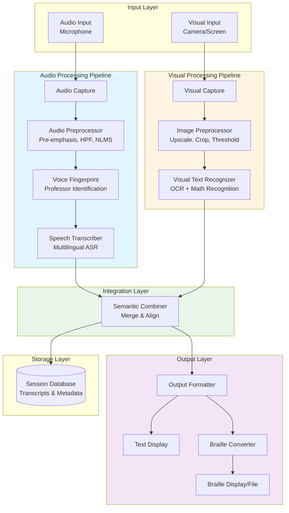

# Design Document: Classroom Live Transcription Tool

## Overview

The Classroom Live Transcription Tool is a real-time accessibility system that captures, processes, and converts classroom lectures into accessible text and braille formats. The system integrates multiple processing pipelines:

1. **Audio Pipeline**: Captures spoken lectures, applies advanced preprocessing filters, performs voice fingerprinting to identify the professor, and transcribes speech to text in multiple languages
2. **Visual Pipeline**: Captures written content (whiteboards, slides), applies image preprocessing, and extracts text using OCR
3. **Semantic Combination**: Intelligently merges audio and visual transcriptions into coherent, contextually accurate output
4. **Output Formatting**: Delivers content in standard text or braille formats with real-time display

The system is designed for classroom environments where students with hearing or visual impairments need immediate access to lecture content. It prioritizes accuracy, low latency (< 3 seconds), and reliability over extended lecture sessions (2+ hours).

### Key Design Principles

- **Modularity**: Each processing stage (audio preprocessing, transcription, image processing, etc.) is independent and replaceable
- **Real-time Performance**: All processing stages are optimized for sub-3-second latency
- **Accuracy First**: Multiple preprocessing stages ensure high-quality input to transcription/OCR engines
- **Accessibility**: Support for multiple output formats (text, braille) and accessible UI controls
- **Robustness**: Graceful degradation when components fail; offline fallback capabilities

## Architecture

### High-Level System Architecture



### Component Interaction Flow

1. **Parallel Capture**: Audio and visual inputs are captured simultaneously
2. **Independent Processing**: Each pipeline processes its input independently
3. **Timestamped Output**: Both pipelines produce timestamped transcription segments
4. **Semantic Merging**: The Semantic Combiner aligns and merges segments based on timestamps and content similarity
5. **Format Conversion**: Output Formatter converts to requested format (text/braille)
6. **Real-time Display**: Content streams to display with minimal latency
7. **Session Storage**: Complete transcripts are saved with metadata for later retrieval

## Components and Interfaces

### 1. Audio Capture Module

**Responsibility**: Capture raw audio from classroom microphones or audio interfaces

**Interface**:
```python
class AudioCaptureModule:
    def start_capture(self, device_id: str, sample_rate: int = 16000) -> None:
        """Start capturing audio from specified device"""
        
    def stop_capture(self) -> None:
        """Stop audio capture"""
        
    def get_audio_stream(self) -> Iterator[AudioChunk]:
        """Yield audio chunks as they are captured"""
        
    def set_buffer_size(self, size_ms: int) -> None:
        """Configure audio buffer size in milliseconds"""

@dataclass
class AudioChunk:
    data: np.ndarray  # Audio samples (float32)
    sample_rate: int  # Sampling rate in Hz
    timestamp: float  # Capture timestamp
    duration: float   # Chunk duration in seconds
```

**Implementation Notes**:
- Uses PyAudio or sounddevice for cross-platform audio capture
- Configurable buffer size (default 1000ms for real-time processing)
- Supports mono and stereo input (converts stereo to mono)
- Normalizes audio to [-1.0, 1.0] range

### 2. Audio Preprocessor

**Responsibility**: Apply signal processing filters to improve audio quality before transcription

**Interface**:
```python
class AudioPreprocessor:
    def __init__(self, sample_rate: int = 16000):
        """Initialize preprocessor with target sample rate"""
        
    def preprocess(self, audio: np.ndarray) -> PreprocessedAudio:
        """Apply full preprocessing pipeline to audio chunk"""
        
    def apply_pre_emphasis(self, audio: np.ndarray, alpha: float = 0.97) -> np.ndarray:
        """Apply pre-emphasis filter to boost high frequencies"""
        
    def apply_highpass_filter(self, audio: np.ndarray, cutoff: float = 120) -> np.ndarray:
        """Apply high-pass filter to remove low-frequency noise"""
        
    def apply_nlms_filter(self, audio: np.ndarray, mu: float = 0.02, 
                         filter_len: int = 32) -> np.ndarray:
        """Apply adaptive NLMS filter for echo/reverb reduction"""
        
    def apply_noise_reduction(self, audio: np.ndarray, 
                             noise_profile: np.ndarray) -> np.ndarray:
        """Apply spectral noise reduction using noise profile"""
        
    def estimate_noise_profile(self, audio: np.ndarray, 
                               duration_sec: float = 1.0) -> np.ndarray:
        """Estimate noise profile from audio segment"""

@dataclass
class PreprocessedAudio:
    audio: np.ndarray      # Cleaned audio
    sample_rate: int       # Sample rate
    timestamp: float       # Original timestamp
    snr_before: float      # SNR before preprocessing (dB)
    snr_after: float       # SNR after preprocessing (dB)
    quality_score: float   # Overall quality score [0-1]
```

**Processing Pipeline**:
1. **Pre-emphasis Filter**: Boosts high-frequency components (y[n] = x[n] - α·x[n-1], α=0.97)
2. **High-Pass Filter**: Butterworth filter with 120 Hz cutoff to remove low-frequency rumble
3. **Adaptive NLMS**: Normalized Least Mean Squares adaptive filter for echo cancellation
4. **Spectral Dereverberation**: Reduces room reverberation using spectral smoothing
5. **Stationary Noise Reduction**: Removes consistent background noise using spectral subtraction
6. **Spectral Gate**: Final noise gate to suppress residual noise below threshold

**Implementation Notes**:
- All filters operate on float32 audio normalized to [-1, 1]
- Noise profile estimated from first 1-2 seconds of audio (assumed silence/background)
- SNR computed before and after to validate improvement
- Quality score based on SNR, spectral flatness, and zero-crossing rate

### 3. Voice Fingerprint Module

**Responsibility**: Identify and isolate the professor's voice from classroom audio

**Interface**:
```python
class VoiceFingerprintModule:
    def enroll_voice(self, audio_path: str, speaker_id: str) -> VoiceProfile:
        """Create voice profile from reference audio sample"""
        
    def load_profile(self, profile_path: str) -> VoiceProfile:
        """Load existing voice profile from disk"""
        
    def save_profile(self, profile: VoiceProfile, path: str) -> None:
        """Save voice profile to disk"""
        
    def identify_speaker(self, audio: np.ndarray, 
                        profiles: List[VoiceProfile]) -> SpeakerMatch:
        """Identify which enrolled speaker is speaking"""
        
    def filter_segments(self, audio_path: str, 
                       segments: List[TranscriptSegment],
                       target_profile: VoiceProfile,
                       threshold: float = 0.35) -> List[TranscriptSegment]:
        """Filter segments to keep only those matching target speaker"""

@dataclass
class VoiceProfile:
    speaker_id: str           # Unique identifier
    embedding: np.ndarray     # Voice embedding vector
    sample_rate: int          # Sample rate of reference audio
    created_at: datetime      # Profile creation timestamp

@dataclass
class SpeakerMatch:
    speaker_id: str           # Matched speaker ID
    confidence: float         # Match confidence [0-1]
    is_match: bool           # Whether confidence exceeds threshold
```

**Implementation Approach**:
- Uses speaker embedding models (e.g., resemblyzer, pyannote.audio, or SpeechBrain)
- Extracts d-dimensional embedding vectors (typically d=256 or d=512)
- Compares embeddings using cosine similarity
- Threshold-based filtering (default 0.35 for classroom environments)
- Supports multiple enrolled profiles (up to 5 professors)

**Voice Fingerprinting Algorithm**:
1. Extract mel-spectrogram from audio
2. Pass through pre-trained speaker encoder (e.g., GE2E, x-vector)
3. Generate embedding vector representing speaker characteristics
4. Compare with enrolled profiles using cosine similarity
5. Accept match if similarity > threshold

### 4. Speech Transcriber

**Responsibility**: Convert preprocessed audio to text in multiple languages

**Interface**:
```python
class SpeechTranscriber:
    def __init__(self, model_name: str = "medium", device: str = "cpu"):
        """Initialize transcription model"""
        
    def transcribe(self, audio_path: str, 
                  language: Optional[str] = None,
                  task: str = "translate") -> TranscriptionResult:
        """Transcribe audio file to text"""
        
    def transcribe_stream(self, audio_stream: Iterator[AudioChunk],
                         language: Optional[str] = None) -> Iterator[TranscriptSegment]:
        """Transcribe audio stream in real-time"""
        
    def detect_language(self, audio: np.ndarray) -> LanguageDetection:
        """Detect spoken language from audio"""
        
    def set_language(self, language: str) -> None:
        """Set target language for transcription"""

@dataclass
class TranscriptionResult:
    segments: List[TranscriptSegment]  # All transcribed segments
    language: str                       # Detected/specified language
    language_probability: float         # Language detection confidence
    duration: float                     # Total audio duration

@dataclass
class TranscriptSegment:
    start: float              # Start time (seconds)
    end: float                # End time (seconds)
    text: str                 # Transcribed text
    confidence: float         # Transcription confidence [0-1]
    speaker_id: Optional[str] # Speaker identifier (if available)
    language: str             # Segment language

@dataclass
class LanguageDetection:
    language: str             # ISO language code
    probability: float        # Detection confidence [0-1]
    alternatives: List[Tuple[str, float]]  # Alternative languages
```

**Implementation Notes**:
- Uses Whisper or Distil-Whisper for multilingual ASR
- Supports at least 5 languages: English, Spanish, French, Mandarin, Hindi
- Automatic language detection with fallback to manual selection
- Translation mode converts non-English to English
- Streaming mode processes audio chunks incrementally
- Confidence scores based on model logits

**Supported Languages**:
- English (en)
- Spanish (es)
- French (fr)
- Mandarin Chinese (zh)
- Hindi (hi)
- Extensible to 90+ languages supported by Whisper

### 5. Visual Capture Module

**Responsibility**: Capture visual content from cameras or screen capture

**Interface**:
```python
class VisualCaptureModule:
    def start_capture(self, source: CaptureSource, fps: int = 1) -> None:
        """Start capturing visual content"""
        
    def stop_capture(self) -> None:
        """Stop visual capture"""
        
    def get_frame_stream(self) -> Iterator[CapturedFrame]:
        """Yield captured frames as they arrive"""
        
    def set_capture_region(self, region: CaptureRegion) -> None:
        """Set specific screen region to capture"""

@dataclass
class CaptureSource:
    type: str  # "camera", "screen", "window"
    device_id: Optional[int] = None  # Camera device ID
    display_id: Optional[int] = None  # Display/monitor ID
    window_title: Optional[str] = None  # Window title pattern

@dataclass
class CapturedFrame:
    image: np.ndarray     # Image data (H x W x 3, RGB)
    timestamp: float      # Capture timestamp
    source: CaptureSource # Source information
    
@dataclass
class CaptureRegion:
    x: int      # Top-left x coordinate
    y: int      # Top-left y coordinate
    width: int  # Region width
    height: int # Region height
```

**Implementation Notes**:
- Uses OpenCV for camera capture
- Uses mss or pyautogui for screen capture
- Configurable frame rate (default 1 FPS for whiteboard/slides)
- Supports multiple capture sources simultaneously
- Region-of-interest selection to focus on relevant content

### 6. Image Preprocessor

**Responsibility**: Enhance captured images before OCR processing

**Interface**:
```python
class ImagePreprocessor:
    def preprocess(self, image: np.ndarray) -> PreprocessedImage:
        """Apply full preprocessing pipeline to image"""
        
    def upscale_image(self, image: np.ndarray, scale_factor: float = 2.0) -> np.ndarray:
        """Upscale low-resolution images"""
        
    def auto_crop(self, image: np.ndarray) -> Tuple[np.ndarray, CropRegion]:
        """Automatically crop to content region"""
        
    def generate_threshold_views(self, image: np.ndarray) -> List[np.ndarray]:
        """Generate multiple threshold views for varying lighting"""
        
    def deskew(self, image: np.ndarray) -> np.ndarray:
        """Correct image skew/rotation"""
        
    def enhance_contrast(self, image: np.ndarray) -> np.ndarray:
        """Apply adaptive histogram equalization"""

@dataclass
class PreprocessedImage:
    original: np.ndarray           # Original image
    upscaled: np.ndarray          # Upscaled image
    cropped: np.ndarray           # Cropped to content
    threshold_views: List[np.ndarray]  # Multiple threshold versions
    best_view: np.ndarray         # Best view for OCR
    crop_region: CropRegion       # Applied crop region
    quality_score: float          # Image quality score [0-1]

@dataclass
class CropRegion:
    x: int
    y: int
    width: int
    height: int
```

**Processing Pipeline**:
1. **Upscaling**: Use bicubic interpolation or super-resolution (ESRGAN) for low-res images
2. **Auto-Cropping**: Detect content boundaries using edge detection and contour analysis
3. **Deskewing**: Detect and correct rotation using Hough transform
4. **Contrast Enhancement**: Apply CLAHE (Contrast Limited Adaptive Histogram Equalization)
5. **Multi-Threshold**: Generate views using Otsu, adaptive, and fixed thresholds
6. **Best View Selection**: Choose view with highest text detection confidence

**Implementation Notes**:
- Upscaling only applied if image resolution < 1920x1080
- Auto-crop uses Canny edge detection + contour finding
- Multi-threshold generates 3-5 views with different binarization methods
- Quality score based on sharpness, contrast, and text detectability

### 7. Visual Text Recognizer

**Responsibility**: Extract text from preprocessed images using OCR

**Interface**:
```python
class VisualTextRecognizer:
    def __init__(self, ocr_engine: str = "tesseract"):
        """Initialize OCR engine"""
        
    def recognize_text(self, image: np.ndarray) -> RecognitionResult:
        """Extract text from image"""
        
    def recognize_math(self, image: np.ndarray) -> MathRecognitionResult:
        """Extract mathematical equations from image"""
        
    def recognize_handwriting(self, image: np.ndarray) -> RecognitionResult:
        """Extract handwritten text from image"""
        
    def detect_content_type(self, image: np.ndarray) -> ContentType:
        """Detect type of content in image"""

@dataclass
class RecognitionResult:
    text: str                    # Extracted text
    confidence: float            # Overall confidence [0-1]
    bounding_boxes: List[BBox]   # Text region locations
    timestamp: float             # Recognition timestamp
    content_type: ContentType    # Detected content type

@dataclass
class MathRecognitionResult:
    latex: str                   # LaTeX representation
    mathml: str                  # MathML representation
    text: str                    # Plain text approximation
    confidence: float            # Recognition confidence
    bounding_box: BBox          # Equation location

@dataclass
class BBox:
    x: int
    y: int
    width: int
    height: int
    text: str
    confidence: float

class ContentType(Enum):
    TEXT = "text"
    MATH = "math"
    DIAGRAM = "diagram"
    MIXED = "mixed"
    HANDWRITING = "handwriting"
```

**Implementation Approach**:
- **Printed Text**: Tesseract OCR or EasyOCR
- **Mathematical Equations**: Texify, LaTeX-OCR, or Mathpix
- **Handwriting**: Google Vision API, Azure Computer Vision, or TrOCR
- **Content Detection**: YOLO or Faster R-CNN for content type classification

**OCR Pipeline**:
1. Detect text regions using text detection model (EAST, CRAFT)
2. Classify regions by content type (text, math, diagram)
3. Apply appropriate recognition engine per region
4. Combine results with spatial layout preservation
5. Post-process with spell checking and grammar correction

### 8. Semantic Combiner

**Responsibility**: Merge audio and visual transcriptions into coherent output

**Interface**:
```python
class SemanticCombiner:
    def combine(self, audio_segments: List[TranscriptSegment],
               visual_segments: List[RecognitionResult]) -> List[CombinedSegment]:
        """Merge audio and visual transcriptions"""
        
    def align_temporal(self, audio_seg: TranscriptSegment,
                      visual_seg: RecognitionResult) -> float:
        """Compute temporal alignment score"""
        
    def align_semantic(self, audio_text: str, visual_text: str) -> float:
        """Compute semantic similarity score"""
        
    def resolve_conflicts(self, audio_text: str, visual_text: str,
                         audio_conf: float, visual_conf: float) -> str:
        """Resolve conflicting transcriptions"""
        
    def eliminate_redundancy(self, segments: List[CombinedSegment]) -> List[CombinedSegment]:
        """Remove duplicate information"""

@dataclass
class CombinedSegment:
    start: float                  # Start time
    end: float                    # End time
    text: str                     # Combined text
    source: str                   # "audio", "visual", or "both"
    confidence: float             # Combined confidence
    audio_segment: Optional[TranscriptSegment]
    visual_segment: Optional[RecognitionResult]
    alignment_score: float        # How well segments align
```

**Combination Algorithm**:
1. **Temporal Alignment**: Match segments with overlapping timestamps (±2 second window)
2. **Semantic Similarity**: Compute text similarity using sentence embeddings (SBERT)
3. **Redundancy Detection**: Identify duplicate content (similarity > 0.8)
4. **Conflict Resolution**: Prefer higher-confidence source; flag discrepancies
5. **Context Integration**: Merge visual context (equations, diagrams) with audio narration
6. **Flow Preservation**: Maintain logical narrative flow and coherence

**Merging Rules**:
- If audio and visual segments overlap temporally AND semantically → merge into single segment
- If audio references visual content ("as shown on the board") → integrate visual content inline
- If visual contains unique information (equations, diagrams) → insert at appropriate temporal position
- If conflict exists → prefer higher confidence source, add footnote with alternative

### 9. Output Formatter

**Responsibility**: Format combined transcription for display and conversion

**Interface**:
```python
class OutputFormatter:
    def format_text(self, segments: List[CombinedSegment],
                   options: TextFormatOptions) -> str:
        """Format segments as plain text"""
        
    def format_html(self, segments: List[CombinedSegment],
                   options: HTMLFormatOptions) -> str:
        """Format segments as HTML"""
        
    def format_markdown(self, segments: List[CombinedSegment]) -> str:
        """Format segments as Markdown"""
        
    def stream_output(self, segment: CombinedSegment) -> None:
        """Stream segment to real-time display"""

@dataclass
class TextFormatOptions:
    include_timestamps: bool = True
    include_speaker_labels: bool = True
    include_confidence: bool = False
    font_size: int = 12
    line_spacing: float = 1.5

@dataclass
class HTMLFormatOptions:
    include_timestamps: bool = True
    include_speaker_labels: bool = True
    highlight_low_confidence: bool = True
    theme: str = "light"  # "light", "dark", "high-contrast"
```

**Formatting Features**:
- Speaker attribution (professor vs. other speakers)
- Timestamp display (optional)
- Confidence highlighting (low-confidence text marked)
- Source indicators (audio, visual, or combined)
- Mathematical notation rendering (LaTeX → Unicode or MathML)
- Adjustable text size and spacing
- Theme support (light, dark, high-contrast)

### 10. Braille Converter

**Responsibility**: Convert text to braille notation

**Interface**:
```python
class BrailleConverter:
    def __init__(self, grade: int = 2):
        """Initialize converter with braille grade (1 or 2)"""
        
    def convert_text(self, text: str) -> BrailleOutput:
        """Convert text to braille"""
        
    def convert_math(self, latex: str) -> BrailleOutput:
        """Convert mathematical notation to Nemeth braille"""
        
    def set_grade(self, grade: int) -> None:
        """Set braille grade (1 or 2)"""
        
    def export_brf(self, text: str, output_path: str) -> None:
        """Export to BRF (Braille Ready Format) file"""

@dataclass
class BrailleOutput:
    braille_text: str            # Unicode braille characters
    brf_text: str                # BRF format (ASCII braille)
    grade: int                   # Braille grade used
    cell_count: int              # Number of braille cells
```

**Implementation Notes**:
- Uses liblouis for braille translation
- Supports Grade 1 (uncontracted) and Grade 2 (contracted) braille
- Nemeth code for mathematical notation
- Unicode braille output for display (U+2800 to U+28FF)
- BRF format for refreshable braille displays and embossers

**Braille Translation Pipeline**:
1. Text normalization (expand abbreviations, handle punctuation)
2. Apply braille translation rules (Grade 1 or 2)
3. Mathematical content → Nemeth code translation
4. Generate Unicode braille for display
5. Generate BRF format for devices

### 11. Session Manager

**Responsibility**: Manage lecture sessions and transcript storage

**Interface**:
```python
class SessionManager:
    def create_session(self, name: str, metadata: SessionMetadata) -> Session:
        """Create new lecture session"""
        
    def start_session(self, session_id: str) -> None:
        """Start recording session"""
        
    def stop_session(self, session_id: str) -> None:
        """Stop recording session"""
        
    def save_transcript(self, session_id: str, 
                       segments: List[CombinedSegment]) -> None:
        """Save transcript to database"""
        
    def load_session(self, session_id: str) -> Session:
        """Load existing session"""
        
    def search_sessions(self, query: str) -> List[Session]:
        """Search sessions by content or metadata"""

@dataclass
class Session:
    id: str                      # Unique session ID
    name: str                    # Session name
    start_time: datetime         # Session start
    end_time: Optional[datetime] # Session end
    duration: float              # Duration in seconds
    metadata: SessionMetadata    # Additional metadata
    transcript: List[CombinedSegment]  # Full transcript

@dataclass
class SessionMetadata:
    course_name: Optional[str]
    professor_name: Optional[str]
    date: datetime
    location: Optional[str]
    tags: List[str]
```

**Storage Implementation**:
- SQLite database for session metadata and transcripts
- JSON export for portability
- Full-text search using FTS5 (SQLite Full-Text Search)
- Automatic backup and versioning

## Data Models

### Core Data Structures

```python
# Audio Data
@dataclass
class AudioChunk:
    data: np.ndarray          # Audio samples (float32, normalized)
    sample_rate: int          # Sampling rate (Hz)
    timestamp: float          # Capture timestamp (seconds)
    duration: float           # Chunk duration (seconds)

# Preprocessed Audio
@dataclass
class PreprocessedAudio:
    audio: np.ndarray         # Cleaned audio
    sample_rate: int          # Sample rate
    timestamp: float          # Original timestamp
    snr_before: float         # SNR before preprocessing (dB)
    snr_after: float          # SNR after preprocessing (dB)
    quality_score: float      # Overall quality [0-1]

# Transcript Segment
@dataclass
class TranscriptSegment:
    start: float              # Start time (seconds)
    end: float                # End time (seconds)
    text: str                 # Transcribed text
    confidence: float         # Confidence [0-1]
    speaker_id: Optional[str] # Speaker identifier
    language: str             # Language code

# Visual Recognition
@dataclass
class RecognitionResult:
    text: str                 # Extracted text
    confidence: float         # Confidence [0-1]
    bounding_boxes: List[BBox]  # Text locations
    timestamp: float          # Recognition timestamp
    content_type: ContentType # Content type

# Combined Output
@dataclass
class CombinedSegment:
    start: float              # Start time
    end: float                # End time
    text: str                 # Combined text
    source: str               # "audio", "visual", "both"
    confidence: float         # Combined confidence
    audio_segment: Optional[TranscriptSegment]
    visual_segment: Optional[RecognitionResult]
    alignment_score: float    # Alignment quality [0-1]
```

### Database Schema

```sql
-- Sessions table
CREATE TABLE sessions (
    id TEXT PRIMARY KEY,
    name TEXT NOT NULL,
    start_time TIMESTAMP NOT NULL,
    end_time TIMESTAMP,
    duration REAL,
    course_name TEXT,
    professor_name TEXT,
    location TEXT,
    created_at TIMESTAMP DEFAULT CURRENT_TIMESTAMP
);

-- Segments table
CREATE TABLE segments (
    id INTEGER PRIMARY KEY AUTOINCREMENT,
    session_id TEXT NOT NULL,
    start_time REAL NOT NULL,
    end_time REAL NOT NULL,
    text TEXT NOT NULL,
    source TEXT NOT NULL,
    confidence REAL,
    speaker_id TEXT,
    language TEXT,
    FOREIGN KEY (session_id) REFERENCES sessions(id)
);

-- Full-text search index
CREATE VIRTUAL TABLE segments_fts USING fts5(
    text,
    content=segments,
    content_rowid=id
);

-- Voice profiles table
CREATE TABLE voice_profiles (
    id TEXT PRIMARY KEY,
    speaker_id TEXT NOT NULL,
    embedding BLOB NOT NULL,
    sample_rate INTEGER,
    created_at TIMESTAMP DEFAULT CURRENT_TIMESTAMP
);

-- Session tags
CREATE TABLE session_tags (
    session_id TEXT NOT NULL,
    tag TEXT NOT NULL,
    PRIMARY KEY (session_id, tag),
    FOREIGN KEY (session_id) REFERENCES sessions(id)
);
```


## Correctness Properties

*A property is a characteristic or behavior that should hold true across all valid executions of a system—essentially, a formal statement about what the system should do. Properties serve as the bridge between human-readable specifications and machine-verifiable correctness guarantees.*

### Audio Preprocessing Properties

**Property 1: Pre-emphasis filter enhances high frequencies**
*For any* audio signal, applying the pre-emphasis filter should increase the energy in high-frequency bands (> 1kHz) relative to low-frequency bands
**Validates: Requirements 1.2**

**Property 2: High-pass filter attenuates low frequencies**
*For any* audio signal, applying the high-pass filter with 120 Hz cutoff should reduce energy below 120 Hz by at least 20 dB
**Validates: Requirements 1.3**

**Property 3: Preprocessing improves SNR**
*For any* audio signal with background noise, the complete preprocessing pipeline should produce output with SNR at least 3 dB higher than the input
**Validates: Requirements 1.5, 1.6**

### Speech Transcription Properties

**Property 4: Transcription latency under 3 seconds**
*For any* preprocessed audio chunk, the speech transcriber should produce text output within 3 seconds of receiving the audio
**Validates: Requirements 2.1, 6.1**

**Property 5: Language detection switches correctly**
*For any* audio containing language changes, the transcriber should detect each language change and produce transcriptions in the correct language for each segment
**Validates: Requirements 2.3**

**Property 6: Speaker diarization distinguishes speakers**
*For any* audio with multiple speakers, the transcription output should assign different speaker IDs to segments from different speakers
**Validates: Requirements 2.4**

**Property 7: Low confidence marking**
*For any* transcription segment with confidence below 70%, the output should include a low-confidence indicator
**Validates: Requirements 2.5, 10.3**

### Voice Fingerprinting Properties

**Property 8: Professor voice identification accuracy**
*For any* audio segment containing the enrolled professor's voice, the voice fingerprint module should correctly identify it with at least 95% accuracy
**Validates: Requirements 3.5**

**Property 9: Professor speech prioritization**
*For any* audio with multiple speakers including the professor, the filtered output should contain only segments where the professor is speaking
**Validates: Requirements 3.2, 3.3**

**Property 10: Professor labeling**
*For any* transcription segment identified as the professor, the output formatter should include a professor label
**Validates: Requirements 3.4**

### Image Preprocessing Properties

**Property 11: Low-resolution upscaling**
*For any* captured image with resolution below 1920x1080, the image preprocessor should upscale it to at least 1920x1080
**Validates: Requirements 4.2**

**Property 12: Auto-cropping focuses on content**
*For any* image with content surrounded by empty space, auto-cropping should produce an output where content occupies at least 80% of the image area
**Validates: Requirements 4.3**

**Property 13: Multi-threshold view generation**
*For any* captured image, the preprocessor should generate at least 3 different threshold views
**Validates: Requirements 4.4**

### Visual Recognition Properties

**Property 14: OCR processing latency under 3 seconds**
*For any* preprocessed image, the visual text recognizer should extract text within 3 seconds
**Validates: Requirements 4.5, 6.2**

**Property 15: Math equation conversion**
*For any* image containing mathematical equations, the recognizer should produce LaTeX or MathML output for each equation
**Validates: Requirements 4.6**

**Property 16: Non-text content labeling**
*For any* image containing diagrams or non-text content, the output should include descriptive labels or indicators for non-textual regions
**Validates: Requirements 4.7**

**Property 17: Handwriting recognition**
*For any* image containing handwritten text, the recognizer should convert handwritten characters to standard text
**Validates: Requirements 4.8**

### Semantic Combination Properties

**Property 18: Audio-visual merging**
*For any* pair of audio and visual transcription streams, the semantic combiner should produce a single unified output stream containing content from both sources
**Validates: Requirements 5.1**

**Property 19: Temporal alignment**
*For any* audio and visual segments with overlapping timestamps (within 2 seconds), the combiner should align them in the output based on temporal proximity
**Validates: Requirements 5.2**

**Property 20: Redundancy elimination**
*For any* audio and visual segments with high semantic similarity (> 0.8), the combiner should merge them into a single segment rather than duplicating content
**Validates: Requirements 5.3**

**Property 21: Context integration**
*For any* visual segment that provides context for an audio segment, the combined output should include the visual context integrated with the audio transcription
**Validates: Requirements 5.4**

**Property 22: Conflict resolution by confidence**
*For any* conflicting audio and visual transcriptions, the combiner should prioritize the source with higher confidence and flag the discrepancy
**Validates: Requirements 5.5**

### Real-Time Processing Properties

**Property 23: Delay notification**
*For any* processing operation that exceeds 5 seconds, the system should generate a user notification about the delay
**Validates: Requirements 6.3**

**Property 24: Stream synchronization**
*For any* audio and visual transcription outputs, the timestamps should be synchronized within 500ms of each other
**Validates: Requirements 6.4**

### Output Formatting Properties

**Property 25: Text formatting with punctuation**
*For any* transcribed content, the output formatter should produce text with proper punctuation and capitalization
**Validates: Requirements 7.1**

**Property 26: Source distinction**
*For any* combined transcription, the output should clearly distinguish between audio-sourced and visual-sourced content
**Validates: Requirements 7.2**

**Property 27: Speaker labeling**
*For any* transcription segment with speaker attribution, the output should include a clear speaker label
**Validates: Requirements 7.3**

### Braille Conversion Properties

**Property 28: Text to braille conversion**
*For any* standard text input, the braille converter should produce valid Grade 2 braille output
**Validates: Requirements 8.1**

**Property 29: Math to Nemeth braille**
*For any* mathematical notation (LaTeX or MathML), the braille converter should produce valid Nemeth braille code
**Validates: Requirements 8.3**

### Configuration and Persistence Properties

**Property 30: Preference persistence**
*For any* user preference changes, the system should save them and restore the same preferences in the next session
**Validates: Requirements 9.4**

### Accuracy Properties

**Property 31: Speech transcription accuracy**
*For any* clear audio sample, the speech transcriber should achieve at least 90% word accuracy
**Validates: Requirements 10.1**

**Property 32: OCR character accuracy**
*For any* printed text image, the visual text recognizer should achieve at least 95% character accuracy
**Validates: Requirements 10.2**

### Error Handling Properties

**Property 33: Audio loss recovery**
*For any* audio input loss event, the system should notify the user and attempt to reconnect to the audio source
**Validates: Requirements 10.4**

**Property 34: Visual loss graceful degradation**
*For any* visual input loss event, the system should notify the user and continue processing audio input without interruption
**Validates: Requirements 10.5**

### Session Management Properties

**Property 35: Timestamp all content**
*For any* active session, all transcribed segments should have valid timestamps
**Validates: Requirements 11.2**

**Property 36: Session saving with metadata**
*For any* completed session, the system should save the complete transcript along with metadata (date, duration, session name)
**Validates: Requirements 11.3**

**Property 37: Session search**
*For any* search query on saved sessions, the system should return all sessions containing text matching the query
**Validates: Requirements 11.5**

### Accessibility Properties

**Property 38: Audio feedback for events**
*For any* critical system event (session start, error, etc.), the system should provide audio feedback
**Validates: Requirements 12.4**

### Performance and Reliability Properties

**Property 39: Extended operation without degradation**
*For any* continuous operation period of 2 hours, the system should maintain consistent processing latency and accuracy throughout
**Validates: Requirements 13.1**

**Property 40: Resource prioritization**
*For any* low-resource condition, the system should maintain transcription processing while reducing non-essential features
**Validates: Requirements 13.2**

**Property 41: Automatic failure recovery**
*For any* temporary processing failure, the system should automatically recover and resume operation without user intervention
**Validates: Requirements 13.3**

**Property 42: Acoustic robustness**
*For any* varying classroom acoustic conditions, the system should maintain transcription quality within 10% of baseline accuracy
**Validates: Requirements 13.4**

## Error Handling

### Error Categories

1. **Input Errors**
   - Audio device not found or inaccessible
   - Visual capture device not found
   - Invalid audio format or corrupted data
   - Invalid image format or corrupted data

2. **Processing Errors**
   - Transcription model loading failure
   - OCR engine failure
   - Voice fingerprint matching failure
   - Semantic combination failure

3. **Output Errors**
   - Braille conversion failure
   - File save failure
   - Display rendering failure
   - Network communication failure (cloud processing)

4. **Resource Errors**
   - Insufficient memory
   - Insufficient disk space
   - CPU/GPU overload
   - Network unavailable

### Error Handling Strategies

**Graceful Degradation**:
- If cloud processing unavailable → fall back to local processing
- If visual capture fails → continue with audio-only transcription
- If voice fingerprinting fails → transcribe all speakers without filtering
- If braille conversion fails → provide text output only

**User Notification**:
- All errors generate user-visible notifications
- Critical errors (audio loss, system crash) trigger audio alerts
- Non-critical errors (low confidence, processing delay) show visual indicators
- Error messages include actionable recovery steps

**Automatic Recovery**:
- Audio/visual input loss → attempt reconnection every 5 seconds
- Processing failures → retry up to 3 times with exponential backoff
- Resource exhaustion → reduce processing quality temporarily
- Network loss → queue operations for later cloud sync

**Logging and Diagnostics**:
- All errors logged with timestamp, context, and stack trace
- Performance metrics logged every 30 seconds
- User actions logged for debugging
- Diagnostic mode available for troubleshooting

### Error Recovery Examples

```python
# Audio input loss recovery
def handle_audio_loss():
    notify_user("Audio input lost. Attempting to reconnect...")
    play_audio_alert()
    
    for attempt in range(MAX_RECONNECT_ATTEMPTS):
        time.sleep(RECONNECT_INTERVAL)
        if try_reconnect_audio():
            notify_user("Audio reconnected successfully")
            return True
    
    notify_user("Unable to reconnect audio. Please check your microphone.")
    return False

# Processing failure with retry
def transcribe_with_retry(audio, max_retries=3):
    for attempt in range(max_retries):
        try:
            return transcriber.transcribe(audio)
        except TranscriptionError as e:
            if attempt < max_retries - 1:
                log_error(f"Transcription failed (attempt {attempt+1}): {e}")
                time.sleep(2 ** attempt)  # Exponential backoff
            else:
                notify_user("Transcription failed. Skipping segment.")
                return None

# Graceful degradation for cloud processing
def process_audio(audio):
    if network_available() and cloud_enabled():
        try:
            return cloud_transcribe(audio)
        except NetworkError:
            log_warning("Cloud processing unavailable, using local")
            return local_transcribe(audio)
    else:
        return local_transcribe(audio)
```

## Testing Strategy

### Dual Testing Approach

The testing strategy employs both **unit tests** and **property-based tests** to ensure comprehensive coverage:

- **Unit Tests**: Verify specific examples, edge cases, and error conditions
- **Property Tests**: Verify universal properties across all inputs
- Together, these approaches provide comprehensive coverage where unit tests catch concrete bugs and property tests verify general correctness

### Property-Based Testing

**Framework**: Use Hypothesis (Python) for property-based testing

**Configuration**:
- Minimum 100 iterations per property test
- Each test tagged with feature name and property number
- Tag format: `# Feature: classroom-live-transcription, Property N: [property text]`

**Test Categories**:

1. **Audio Processing Properties**
   - Test pre-emphasis filter on random audio signals
   - Test high-pass filter attenuation on various frequencies
   - Test SNR improvement across different noise profiles
   - Test NLMS filter echo reduction

2. **Transcription Properties**
   - Test latency with audio chunks of varying lengths
   - Test language detection with multilingual audio
   - Test speaker diarization with multi-speaker audio
   - Test confidence scoring on degraded audio

3. **Voice Fingerprinting Properties**
   - Test identification accuracy with enrolled voices
   - Test filtering with mixed speaker audio
   - Test false positive rate with non-enrolled speakers

4. **Image Processing Properties**
   - Test upscaling on low-resolution images
   - Test auto-cropping on images with varying content layouts
   - Test multi-threshold generation on images with different lighting

5. **OCR Properties**
   - Test text extraction accuracy on printed text
   - Test math recognition on equation images
   - Test handwriting recognition on handwritten samples

6. **Semantic Combination Properties**
   - Test merging with overlapping audio/visual segments
   - Test redundancy elimination with duplicate content
   - Test conflict resolution with differing transcriptions

7. **Output Formatting Properties**
   - Test text formatting on random transcriptions
   - Test braille conversion on various text inputs
   - Test Nemeth braille on mathematical notation

8. **Session Management Properties**
   - Test timestamp assignment on all segments
   - Test session saving and loading
   - Test search functionality with various queries

9. **Error Handling Properties**
   - Test recovery from simulated input loss
   - Test graceful degradation under resource constraints
   - Test automatic retry mechanisms

### Unit Testing

**Framework**: pytest (Python)

**Test Categories**:

1. **Component Integration Tests**
   - Test audio capture → preprocessing → transcription pipeline
   - Test visual capture → preprocessing → OCR pipeline
   - Test semantic combiner with real audio and visual data
   - Test end-to-end session workflow

2. **Edge Case Tests**
   - Empty audio input
   - Silent audio (no speech)
   - Blank images (no text)
   - Single-speaker vs. multi-speaker audio
   - Very short audio segments (< 1 second)
   - Very long sessions (> 2 hours)

3. **Error Condition Tests**
   - Audio device disconnection
   - Visual capture failure
   - Network unavailability
   - Disk space exhaustion
   - Invalid input formats

4. **Configuration Tests**
   - Language selection
   - Output format selection
   - Voice profile enrollment
   - Preference persistence

5. **Accuracy Benchmark Tests**
   - Transcription accuracy on standard test sets (LibriSpeech, Common Voice)
   - OCR accuracy on standard test sets (MNIST, EMNIST)
   - Voice identification accuracy on speaker verification datasets

### Test Data

**Audio Test Data**:
- Clean speech samples (LibriSpeech)
- Noisy classroom recordings
- Multi-speaker conversations
- Multilingual speech samples
- Various acoustic conditions (reverberant, outdoor, etc.)

**Visual Test Data**:
- Printed text images (various fonts, sizes)
- Handwritten text samples
- Mathematical equation images
- Whiteboard photos (various lighting conditions)
- Slide screenshots

**Integration Test Data**:
- Synchronized audio-visual lecture recordings
- Real classroom session recordings
- Simulated lecture scenarios

### Continuous Integration

- All tests run on every commit
- Property tests run with 100 iterations in CI
- Performance benchmarks tracked over time
- Test coverage target: 85% code coverage
- Integration tests run nightly with full test data

### Performance Testing

- Latency benchmarks for each processing stage
- Memory usage profiling during extended sessions
- CPU/GPU utilization monitoring
- Throughput testing (segments processed per second)
- Stress testing with concurrent sessions

